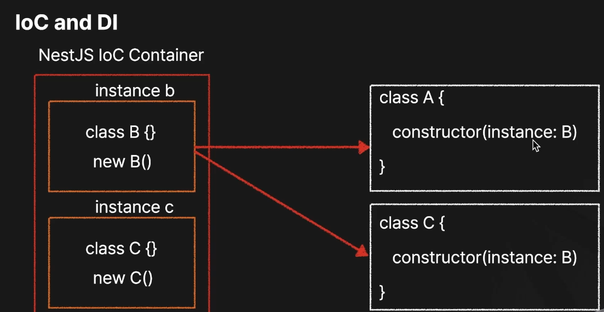

출처 : https://fastcampus.co.kr/dev_online_nestjs

<br><br>

## 일반 인스턴스화

```jsx
class A {
	const b = B();
}
```

```jsx
class B {}
```

<br><br>

## Dependency Injection

```jsx
class A {
	constructor(instance:B)
}
```

```jsx
class B {}
```

<br>

클래스 A가 클래스 B에 의존하고 있고, 클래스 B를 클래스 A에서 사용해야 할떄, 클래스 A에서 직접 B를 생성하는 것이 아닌 외부에서 B 인스턴스를 생성자(constructor)를 사용하여 A에 주입하여 넣어주는 방식을 (Dependencty Injection) 이라고 한다.

<br><br>

## Inversion of Control (제어의 역전)

### IoC Container

```jsx
class B {}
```

```jsx
class A {
	constructor(instance: B)
}
```

```jsx
class C {
	constructor(instance: B)
}
```

<br>

**IoC Container**라는 별도의 관리 주체가 객체들의 생성과 생명주기를 관리하며, 필요할 때 Dependency Injection을 수행해 객체 간의 의존성을 해결해 줍니다. 이렇게 제어의 흐름을 개발자가 직접 담당하지 않고, IoC 컨테이너가 대신 관리하는 것을 Inversion of Control이라고 합니다.

<br><br>



<br><br>

## 📘 추가 설명 (GPT 기반)

<br>

> ### ✅ **1. 제어의 역전 (IoC: Inversion of Control)**
>
> **개념**
>
> - 전통적인 방식에서는 클래스나 함수 내부에서 필요한 의존성을 **직접 생성(new)** 해서 사용합니다.
> - **IoC는 객체 생성과 의존성 관리 책임을 개발자가 아닌 프레임워크(NestJS)가 대신 가지는 것**입니다.
> - 즉, 애플리케이션의 흐름 제어를 개발자가 아닌 **컨테이너(또는 프레임워크)** 가 담당하는 방식입니다.

<br><br>

> **예시 (IoC 없는 전통적인 코드)**
>
> ```ts
> class UserService {
>   private userRepository: UserRepository;
>
>   constructor() {
>     this.userRepository = new UserRepository(); // 직접 생성
>   }
> }
> ```
>
> **IoC 적용 후 (NestJS 방식)**
>
> ```ts
> @Injectable()
> class UserService {
>   constructor(private readonly userRepository: UserRepository) {} // 프레임워크가 주입
> }
> ```
>
> 위에서 `UserRepository` 객체는 개발자가 직접 생성하지 않고,  
> NestJS의 **IoC 컨테이너**가 대신 생성해서 `UserService`에 주입합니다.

---

<br>

> ### ✅ **2. 의존성 주입 (DI: Dependency Injection)**
>
> **개념**
>
> - 의존성 주입은 **필요한 의존 객체를 외부에서 전달(주입)** 하는 디자인 패턴입니다.
> - NestJS에서는 클래스가 필요로 하는 의존성을 **생성자(constructor)** 를 통해 주입합니다.
> - NestJS는 내부적으로 **IoC 컨테이너**를 통해 의존성을 관리하고 주입합니다.

<br>

> **예시 구조: `UserService`가 `UserRepository`에 의존하는 경우**

<br>

> ✅ `user.repository.ts`
>
> ```ts
> import { Injectable } from "@nestjs/common";
>
> @Injectable()
> export class UserRepository {
>   findUser(id: number) {
>     return { id, name: "John Doe" }; // 예시용 더미 데이터
>   }
> }
> ```

<br>

> ✅ `user.service.ts`
>
> ```ts
> import { Injectable } from "@nestjs/common";
> import { UserRepository } from "./user.repository";
>
> @Injectable()
> export class UserService {
>   constructor(private readonly userRepository: UserRepository) {}
>
>   getUser(id: number) {
>     return this.userRepository.findUser(id);
>   }
> }
> ```

<br>

> ✅ `user.controller.ts`
>
> ```ts
> import { Controller, Get, Param } from "@nestjs/common";
> import { UserService } from "./user.service";
>
> @Controller("users")
> export class UserController {
>   constructor(private readonly userService: UserService) {}
>
>   @Get(":id")
>   getUser(@Param("id") id: string) {
>     return this.userService.getUser(Number(id));
>   }
> }
> ```

<br>

> ✅ `app.module.ts`
>
> ```ts
> import { Module } from "@nestjs/common";
> import { UserService } from "./user.service";
> import { UserRepository } from "./user.repository";
> import { UserController } from "./user.controller";
>
> @Module({
>   imports: [],
>   controllers: [UserController],
>   providers: [UserService, UserRepository],
> })
> export class AppModule {}
> ```

---

## 🔁 요약

| 개념              | 설명                                                                                   |
| ----------------- | -------------------------------------------------------------------------------------- |
| IoC (제어의 역전) | 객체 생성과 흐름 제어를 프레임워크에 맡김                                              |
| DI (의존성 주입)  | 필요한 의존성을 외부에서 주입 받음 (주로 생성자를 통해)                                |
| NestJS에서 역할   | `@Injectable()`로 클래스를 주입 대상(Provider)으로 등록하고, 생성자 주입으로 DI를 활용 |
