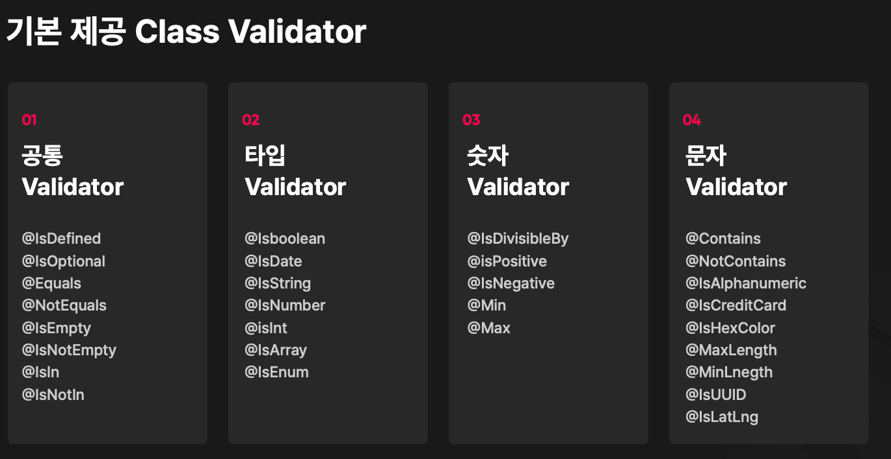

출처 : https://fastcampus.co.kr/dev_online_nestjs

<br><br>

## class-validator & class-transformer

<br>

## **Class Validator의 특성**

- TS Decorator를 사용해서 클래스를 검증한다 (Validate)
- 동기 (Synchronous) 비동기(Asynchronous) 방식 모두를 지원한다
- Class Validator 자체적으로 제공해주는 Validator들을 사용 할 수 있다
- 커스텀 Validator를 쉽게 만들 수 있다
- 커스텀 에러 메세지를 반환 할 수 있다

<br>

### **class Validator 적용 예제**

```jsx
class User {
  @IsNotEmpty()
  name: string;

  @IsEmail()
  email: string;
}
```

```jsx
const user = new User();

user.name = "";
user.email = "invalid-email";

validate(user).then((error) => {
  // 여기서 에러 반환
});
```



### **반환 에러 구조**

```jsx
{
	target: Object;
	property: string;
	value: any;
	constraints?: {
		[type: string]: string;
	};
	children?: ValidationError[];
}
```

- target: 검증한 객체
- property: 검증 실패한 프로퍼티
- value: 검증 실패한 값
- constraints: 검증 실패한 제약조건
- children: 프로퍼티의 모든 검증 실패 제약 조건

<br><br>

### **커스텀 에러 메세지**

```jsx
class User {
  @IsNotEmpty({
    message: "이름을 입력해주세요!",
  })
  name: string;

  @IsEmail(
    {},
    {
      message: "정확한 주소를 입력해주세요!",
    }
  )
  email: string;
}
```

<br>

- Decorator의 message 프로퍼티에 검증 실패했을때의 에러 메세지를 입력해주면 된다.

<br>

```jsx
/* eslint-disable @typescript-eslint/no-unused-vars */

import {
  Contains,
  Equals,
  IsAlphanumeric,
  IsArray,
  IsBoolean,
  IsCreditCard,
  IsDate,
  IsDateString,
  IsDefined,
  IsDivisibleBy,
  IsEmpty,
  IsEnum,
  IsHexColor,
  IsIn,
  IsInt,
  IsLatLong,
  IsNegative,
  IsNotEmpty,
  IsNotIn,
  IsNumber,
  IsOptional,
  IsPositive,
  IsString,
  IsUUID,
  Max,
  MaxLength,
  Min,
  MinLength,
  NotContains,
  NotEquals,
  registerDecorator,
  Validate,
  ValidationArguments,
  ValidationOptions,
  ValidatorConstraint,
  ValidatorConstraintInterface,
} from 'class-validator';

enum MovieGenre {
  Fantasy = 'fantasy',
  Action = 'action',
}

// custom-validator
@ValidatorConstraint({
  async: true,
})
class PasswordValidator implements ValidatorConstraintInterface {
  validate(
    value: any,
    validationArguments?: ValidationArguments,
  ): Promise<boolean> | boolean {
    // 비밀번호의 길이는 4~8자 이어야 한다.
    return value.length > 4 && value.length < 8;
  }
  defaultMessage?(validationArguments?: ValidationArguments): string {
    return '비밀번호의 길이는 4~8자 이어야 합니다. 입력된 비밀번호 ($value)';
  }
}

function IsPasswordValid(validationOptions?: ValidationOptions) {
  return function (object: object, propertyName: string) {
    registerDecorator({
      target: object.constructor,
      propertyName,
      options: validationOptions,
      validator: PasswordValidator,
    });
  };
}

export class UpdateMovieDto {
  @IsNotEmpty()
  @IsOptional()
  title?: string;

  @IsNotEmpty()
  @IsOptional()
  genre?: string;

  // Type Validator

  //   @IsDefined() null || undefined 인지 확인
  //   @IsOptional() Option 상태로 만들어주는것 (필수값 X)
  //   @Equals('code factory') : 해당 값만 가능함
  //   @NotEquals('code factory') : 해당 값만 불가능함
  //   @IsEmpty() null || undefined || '' 인지 확인
  //   @IsNotEmpty() : null, undefined, '' 모두 불가능
  //   @IsIn(['action', 'fantasy']) 안의 값은 [] 내부의 값이어야 함
  //   @IsNotIn(['action', 'fantasy']) 안의 값은 [] 내부의 값이여서는 안됨
  //   @IsBoolean() 참 거짓 여부, 스트링값은 오지 못함
  //   @IsString() 스트링인지 여부
  //   @IsNumber() 숫자 인지 여부
  //   @IsInt() 정수인지 여부
  //   @IsArray() Array 인지 여부
  //   @IsEnum(MovieGenre)
  //   @IsDateString() 연도-월-일-시간 형태로 와야함

  // Number Validator

  //   @IsDivisibleBy(5) 나누어 질수 있는지 여부
  //   @IsPositive() 양수인지 여부 (음수면 안됨)
  //   @IsNegative() 음수인지 여부 (양수면 안됨)
  //   @Min(100) 최솟값
  //   @Max(100) 최댓값 (max와 min은 같이 사용할수 있다)

  // String Validator

  //   @Contains('code factory') 해당값을 담고있는지의 여부
  //   @NotContains('code factory') 해당 값을 담고있지 않은지 여부 (code factory를 넣으면 오류)
  //   @IsAlphanumeric() 숫자와 알파벳으로만 이루어져있는지의 여부
  //   @IsCreditCard() 실제로 존재하는 카드의 숫자가 들어왔는지 여부 , ex)  "1234-1234-1234-1234" (X)  "5312-1234-1234-1234" (O)
  //   @IsHexColor() 16진수 인지 여부 확인
  //   @MaxLength(16) 16보다 적어야함, maxLength인 16이 넘어가면 오류
  //   @MinLength(4) 4보다는 커야함, minLength인 4보다 작으면 오류
  //   @IsUUID() UUID에 해당하는 타입인지 확인
  //   @IsLatLong() 위도, 경도 형식의 유형인지 확인

  //   @Validate(PasswordValidator, {
  //     message: '다른 에러 메세지',
  //   })

  @IsPasswordValid({
    message: '다른 메세지',
  })
  test: string;
}

```

<br>

## **Class Transformer 특성**

- TS Decorator를 사용해서 클래스를 변환한다 (Validate)
- 직렬화 (Serialization)과 역직렬화 (Deserialization) 그리고 인스턴스로 변환을 담당한다.
- 중첩된 (Nested) 객체에도 매우 쉽게 적용 가능하다
- 커스텀 Transformer로 어떤 변환이든 가능하다
- Class Validator를 제작한 개발자가 시작한 프로젝트다

<br>

## Class Transformer 적용 예제

```jsx
class User {
  @Exclude()
  name: string;

  @Transform(({ value }) => value.toUpperCase())
  email: string;
}
```

```jsx
const plainUser = {
  name: "John",
  email: "john@example.com",
};

const user = plainToClass(User, plainUser);

// User { email : 'JOHN@EXAMPLE.COM' }
console.log(user);

const plain = classToPlain(user);

// { email: 'JOHN@EXAMPLE.COM' }
console.log(plain);
```

<br>

## 중첩 클래스 변환

```jsx
class Address {
  city: string;
  country: string;
}

class User {
  @Exclude()
  name: string;

  @Type(() => Address)
  address: Address;
}
```

```jsx
const plainUser = {
  name: "John",
  address: {
    city: "New York",
    country: "USA",
  },
};

const user = plainToClass(User, plainUser);

// User { address : Address { city: 'New York', country: 'USA' } }
console.log(user);
```

<br>

## Custom Transformer

```jsx
class User {
  @Exclude()
  name: string;

  @Trnasform(({ value }) => value.toLowerCase())
  email: string;
}
```

```jsx
const plainUser = {
  name: "John",
  email: "JOHN@EXAMPLE.COM",
};

const user = plainToClass(User, plainUser);

// john@example.com
console.log(user.email);
```

<br><br>

## 참고

### class-transformer이 지원하는 기능

<br>

## plainToClass

앞선 코드에서 보았던 plainToClass method 입니다. 이것은 자바스크립트 객체를 특정 클래스의 인스턴스로 변환합니다.

```jsx
import { plainToClass } from "class-transformer";

let users = plainToClass(User, userJson); // to convert user plain object a single user. also supports arrays
```

<br>

## classToPlain

이 method는 클래스를 객체를 일반 자바스크립트 객체로 다시 변환합니다.

```jsx
import { classToPlain } from "class-transformer";
let photo = classToPlain(photo);
```

<br>

## instanceToInstance

이 method는 클래스 객체를 새로운 인스턴스로 변환합니다. 객체를 전체 복제한다고 보시면 됩니다.

```jsx
import { instanceToInstance } from "class-transformer";
let photo = instanceToInstance(photo);
```

<br>

## serialize & deserialize

직렬화와 역직렬화는 아래 코드처럼 사용할 수 있습니다. 데이터 크기를 줄여서 주고 받을 때 사용합니다.

```jsx
import { serialize, deserialize, deserializeArray } from "class-transformer";
let photo = serialize(photo);

let photo = deserialize(Photo, photo);

let photos = deserializeArray(Photo, photos); // 배열을 역직렬화합니다.
```

<br>

## 제네릭을 활용한 API 함수

앞서 다룬 plainToClass는 계속해서 호출해야 한다는 단점이 있습니다.
이것이 귀찮다면 별도의 함수를 만들어서 사용할 수 있습니다.

```jsx
export const instance: AxiosInstance = axios.create({
  responseType: 'json',
  validateStatus(status) {
    return [200].includes(status);
  },
});

export async *function* request<T>(
  config: AxiosRequestConfig,
  classType: any,
): Promise<T> {
  const response = await instance.request<T>(config);
  return plainToClass<T, AxiosResponse['data']>(classType, response.data);
}
```

위와 같이 말이죠. Axios를 많이 사용하기 때문에 Axios 객체로 만들었는데요. 비슷하게 다른 곳에서도 제네릭으로 만들 수 있습니다.

```jsx
export *class* PaginatedResponseDto<T> {

  @Exclude()
  private type: Function;

  @Expose()
  @ApiProperty()
  @Type(opt => (opt.newObject as PaginatedResponseDto<T>).type)
  data: T[];

  constructor(type: Function) {
    this.type = type;
  }
}
```

위 코드는 NestJS에서 많이 사용하는 코드입니다. DTO 클래스를 만들 때 제네릭을 통해 리터럴 객체를 클래스 객체로 자동으로 변환합니다.
위와 같이 작성하면 Request 요청 중 Post로 받을 때 body json을 자동으로 클래스 객체로 치환해줍니다. 그리고 데코레이터 설정에 따라 필요한 값을 매핑하거나 제외할 수 있습니다. 그리고 복잡한 Type도 대응해서 매핑이 가능합니다.

<br>

## 중첩 객체 매핑

클래스 내부에는 일반 속성 뿐만 아니라 다른 클래스를 넣어 사용하는 중첩된 객체도 존재합니다. 물론 일반 리터럴 객체에도 중첩된 값들이 들어갈 수 있습니다. 이것을 매핑하기 위해서는 @Type 데코레이터를 사용합니다.

```jsx
import { Type, plainToClass } from 'class-transformer';

export *class* Album {
  id: number;

  name: string;

  @Type(() => Photo)
  photos: Photo[];
}

export *class* Photo {
  id: number;
  filename: string;
}

let album = plainToClass(Album, albumJson);
```

위와 같이 Type 데코레이터를 통해 중첩된 객체를 클래스로 매핑 할 수 있습니다.

<br>

## 데코레이터

<br>

## Expose

expose 데코레이터는 getter 또는 method에 사용할 수 있으며, 사용하면 반환하는 내용을 노출할 수 있습니다.

```jsx
import { Expose } from "class-transformer";

export class User {
  @Expose({ name: "uid" })
  id: number;
  firstName: string;
  lastName: string;
  password: string;

  @Expose()
  get name() {
    return this.firstName + " " + this.lastName;
  }

  @Expose()
  getFullName() {
    return this.firstName + " " + this.lastName;
  }
}
```

<br>

## @Exclude

특정 속성을 제외해서 반환을 막을 수 있습니다.

```jsx
import { Exclude } from "class-transformer";

export class User {
  id: number;

  email: string;

  @Exclude({ toPlainOnly: true })
  password: string;
}
```

<br>

## @Type

일반 자바스크립트 객체를 다양한 형태로 변환하는 데코레이터입니다.
날짜 문자열을 Date 객체로 반환하고, 배열로 변경하거나, Transform 데코레이터를 활용하여 추가 데이터 변환을 할 수 있습니다.

```jsx
import { Type } from "class-transformer";
import * as moment from "moment";
import { Moment } from "moment";

export class Skill {
  name: string;
}

export class Weapon {
  name: string;
  range: number;
}

export class Player {
  name: string;

  @Type(() => Date)
  registrationDate: Date;

  @Type(() => Date)
  @Transform(({ value }) => moment(value), { toClassOnly: true })
  date: Moment;

  @Type(() => Skill)
  skills: Set<Skill>;

  @Type(() => Weapon)
  weapons: Map<string, Weapon>;
}
```
