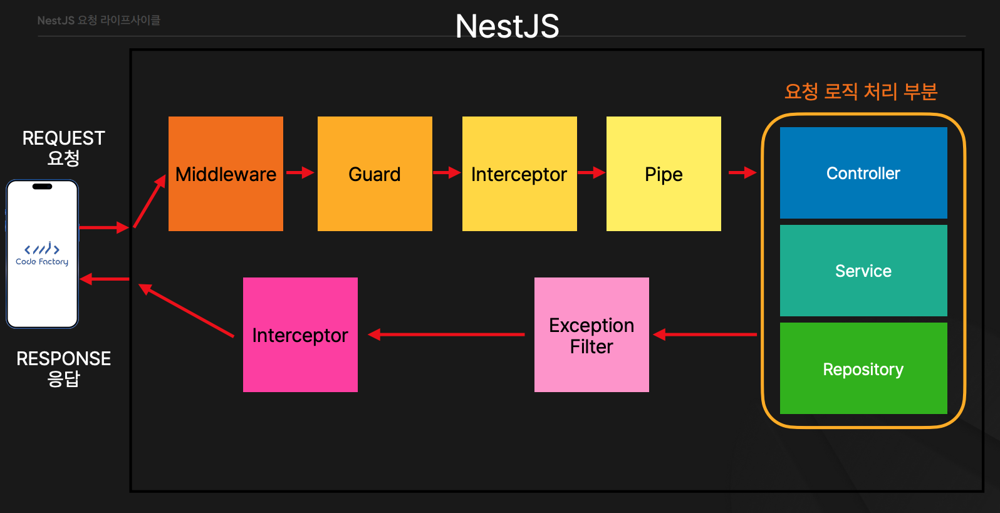

출처 : https://fastcampus.co.kr/dev_online_nestjs

  

## NestJS 요청 라이프사이클

### **NestJS 요청 라이프사이클 순서**

 

  
<strong>📥 클라이언트 요청 (Request)</strong>

  

    클라이언트가 서버에 요청을 보냅니다. 이 요청은 HTTP 요청으로, 예를 들어 사용자가 특정 데이터에 접근하거나 리소스를 수정하는 API 호출일 수 있습니다.
  

  
<strong>🛡️ Middleware (미들웨어)</strong>

  

    미들웨어는 요청(Request)을 처음으로 처리하는 단계입니다. 요청을 가로채고, 로그를 기록하거나 요청을 변형하는 등의 작업을 수행합니다. 
    주로 모든 요청에 공통 적용되는 작업(예: 인증, 로깅)을 처리하며, 조건에 따라 여기서 요청이 종료될 수도 있습니다.
  

  
<strong>🔐 Guard (가드)</strong>

  

    가드는 요청을 컨트롤러로 전달하기 전, 인증이나 권한 검사를 수행합니다. 
    사용자가 적절한 권한을 갖고 있는지를 검사하며, 조건을 만족하지 않으면 요청을 차단합니다.
  

  
<strong>⚙️ Interceptor (인터셉터 - 요청 전처리)</strong>

  

    가드 다음 단계로 실행되며, 요청과 응답 모두에 전/후처리를 할 수 있습니다. 
    로깅, 응답 가공, 캐싱 등의 작업을 처리할 수 있는 위치입니다.
  

  
<strong>🔧 Pipe (파이프)</strong>

  

    클라이언트가 보낸 요청 데이터의 유효성을 검사하고, 필요한 경우 형 변환을 수행합니다. 
    예: 문자열을 숫자로 변환하거나, 객체로 매핑하는 작업 등.
  

  
<strong>🧭 Controller (컨트롤러)</strong>

  

    라우팅 경로에 따라 요청을 처리할 핸들러로 전달하는 역할을 합니다. 
    내부에서 서비스 로직을 호출하여 결과를 반환합니다.
  

  
<strong>🛠️ Service (서비스)</strong>

  

    비즈니스 로직을 수행하는 계층입니다. 데이터 처리, 계산, 외부 API 호출 등의 핵심 기능을 구현합니다. 
    컨트롤러는 주로 이 계층을 호출해 작업을 수행합니다.
  

  
<strong>📦 Repository (레포지토리)</strong>

  

    데이터베이스와 직접 상호작용하는 계층입니다. ORM 등을 통해 데이터의 CRUD 작업을 처리합니다. 
    서비스는 레포지토리를 통해 데이터의 영속성을 관리합니다.
  

  
<strong>🚨 Exception Filter (예외 필터)</strong>

  

    요청 처리 중 발생하는 모든 예외를 처리합니다. 예외 발생 시 적절한 메시지와 상태 코드를 클라이언트에 전달합니다. 
    예: 인증 실패, 유효하지 않은 입력 등.
  

  
<strong>🔄 Interceptor (응답 후처리)</strong>

  

    컨트롤러에서 응답이 생성된 후 실행됩니다. 응답을 변형하거나 로그를 기록하는 등의 후처리를 수행할 수 있습니다.
  

  
<strong>📤 응답 (Response)</strong>

  

    모든 처리가 끝난 후 클라이언트에게 최종 응답을 반환합니다. 화면 표시 또는 후속 동작을 위한 결과가 전달됩니다.
  

### 정리

NestJS의 요청 라이프사이클은 다음과 같이 순서대로 흐릅니다:

1. **Request (요청)**
2. **Middleware (미들웨어)**
3. **Guard (가드)**
4. **Interceptor (인터셉터 - 요청 전처리)**
5. **Pipe (파이프)**
6. **Controller (컨트롤러)**
7. **Service (서비스)**
8. **Repository (레포지토리)**
9. **Exception Filter (예외 필터)**
10. **Interceptor (인터셉터 - 응답 후처리)**
11. **Response (응답)**
