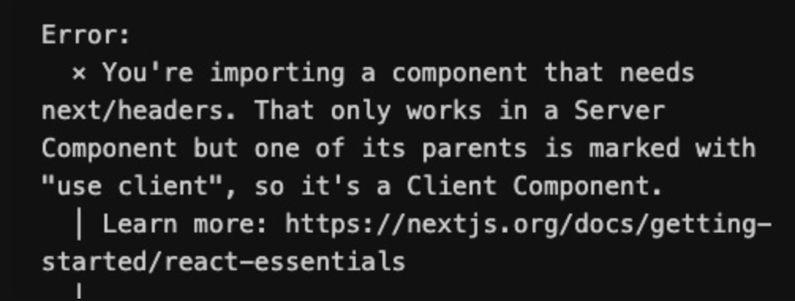

# Next.js란?

Next.js는 Vercel에서 개발한 React 프레임워크로, 서버 사이드 렌더링(SSR), 클라이언트 사이드 렌더링(CSR), API 라우팅 등의 다양한 최적화 기능을 제공합니다.
Next.js을 사용하면, React의 기본 기능을 확장해, 보다 빠르고 안정적으로 웹 애플리케이션을 개발할 수 있습니다.

# 설치 및 구성

다음 명령으로 Next.js 프로젝트를 설치합니다.
각 질문에 Yes 또는 No로 답변하며, 여기에서는 TypeScript와 ESLint를 사용하고 Tailwind CSS는 사용하지 않습니다.

npx create-next-app@latest <프로젝트이름>
    ✔ Would you like to use TypeScript? … Yes  # 타입스크립트 사용 여부
    ✔ Would you like to use ESLint? … Yes  # ESLint 사용 여부
    ✔ Would you like to use Tailwind CSS? … No  # Tailwind CSS 사용 여부
    ✔ Would you like to use `src/` directory? … No  # src/ 디렉토리 사용 여부
    ✔ Would you like to use App Router? (recommended) … Yes  # App Router 사용 여부
    ✔ Would you like to customize the default import alias (@/*)? … No  # `@/*` 외 경로 별칭 사용 여부

# Server vs Client

Next.js에서는 서버 컴포넌트(Server Component)와 클라이언트 컴포넌트(Client Component)를 구분해 코드 일부가 서버 혹은 클라이언트에서 출력될 수 있도록 만들 수 있습니다.
기본적으로 생성하는 모든 컴포넌트는 서버 컴포넌트입니다!
클라이언트 컴포넌트로 변경/사용하려면 다음과 같이 컴포넌트 최상단에 'use client' 선언이 필요하고, 해당 선언이 없으면 서버 컴포넌트입니다.

서버 컴포넌트와 클라이언트 컴포넌트는 다음과 같이 사용할 수 있는 일부 API가 다릅니다.

서버 컴포넌트만 사용:

cookies
headers
redirect
...
클라이언트 컴포넌트만 사용:

useState
useEffect
onClick
onChange
useRouter
useParams
...

각 서버와 클라이언트 컴포넌트에서 서로 맞지 않는 API를 사용하면 다음 이미지와 같이, 바로 에러를 표시하기 때문에 금방 구분할 수 있습니다.

